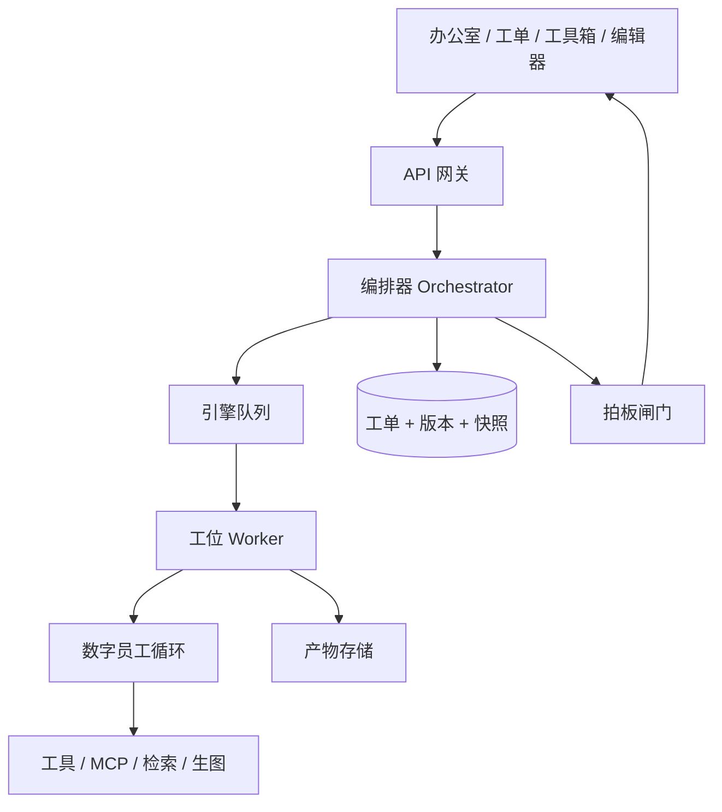

# AI Agent 作业流水线 · 产品架构设计

> 目标：老板下一句话，系统按固定工位（或队长拆单）把活做完，上一站产物成为下一站输入，人设和 Skill 可随时改，作业可暂停、可恢复、可单站重试。
> 第一条流水线模板来自 [RichmanDP/AI_Movie_Skills](https://github.com/RichmanDP/AI_Movie_Skills)：现成 `drama-*` Skill 变成数字员工，总入口变成编排器。MVP 目标是 **一句话出符合目标地区文化的高质量短剧剧本**；导演/拆镜二期。
> 参考：派活工单指针 + AgentTeams 队长 + Anthropic Workflows vs Agents。交接用目标卡和契约包，不传对话。

---

## 1. 产品定位

这不是一个万能聊天 Agent，也不是 Dify 那种自由画布。它是 **作业流水线**：一次交付对应一张工单，工单在工位上移动，每个工位是一个窄任务数字员工。

第一条要落地的模板是 **AI Movie Skill｜短剧编剧室**。仓库里的 `$drama-production-orchestrator` 不再当员工：它变成 LangGraph 模板（导航、路由、Gate、回执汇总）。19 个专业 `drama-*` Skill 变成工位员工，各自钉死自己的 `SKILL.md`。

两种作业形态并存，由流水线模板决定，不要合成一个大群聊。

| 形态 | 对标 | 何时用 |
|---|---|---|
| 顺序工位 | 短剧编剧室：编剧 → 评分官 → 导演 → 拆镜师 → … | 交付物能拆成固定 SOP（短剧前期、后期） |
| 队长派工 | [dsh-agent-teams](https://github.com/NanmiCoder/dsh-agent-teams)（DeepSeek Harness 插件，不是 agentscope-ai/agentteams）：船长拆解·派发·汇总，成员等待依赖 | 目标明确但中途会分叉并行（角色/场景/道具三资产并行） |

进料口是 `project.yaml` 简报（片名、市场、平台、集数、时长、画幅）。工具箱以后可以接，但 MVP 不靠热点卡开工。

---

## 2. 设计原则

0. **优先复用 GitHub 上已经能跑的层，只自建产品壳。** 编排、耐久、Skill 格式、工位工人、队长派工都有现成实现；不要再写一套 DAG / checkpointer / ReAct 循环。
1. **编排是代码，工位里才是模型。** 下一站由模板边决定，不由 LLM 即兴路由。
2. **工位之间传产物，不传对话全文。** 落盘 / 对象存储，编排器只拿 URI + 短摘要 + schema。
3. **工单是耐久状态。** 进程挂了能从当前工位接着跑，不能整单重烧。
4. **人闸只挡高成本副作用。** 大纲锁定、对外发布、花钱、真实平台提交。不要每个 token 都等人。
5. **Prompt / Skill 可编辑，但运行中的工单钉住版本。** 改人设只影响下一张单或下一站，避免半单人格分裂。
6. **失败原单续跑。** 租户级 CAS 抢开工；微信等真实提交禁止自动重放。
7. **目标卡全局只读，SOP 管手，交接包管眼，仓库管全文。** 员工看不到别人的聊天，也看不到用不到的站。编排器打包交接，模型不得自己「读完再意译给下一站」。
8. **文件存在 ≠ 回执有效 ≠ 人审通过。** prompt 完成不等于图片/音频/视频完成；外部终态 `unknown` 禁止自动重试；发布默认 `publish_ready_not_uploaded`。这是 AI_Movie_Skills 的诚实边界，流水线必须原样保住。

---

## 3. 核心对象

```text
PipelineTemplate     流水线模板（工位图 / 队长图）
  └─ StationDef      工位定义：角色、入出契约、门、工具白名单
AgentRole            数字员工：prompt、skills[]、model、tools
Skill                可编辑技能包（SKILL.md + 版本）
Job                  一次作业（工单）
  └─ StationRun      某工位的一次执行（可多版本）
TaskNode             队长模式下的 t1…tn（带依赖）
Artifact             产物（文件 / JSON），用 URI 引用
Gate                 人闸：通过 / 驳回 / 改意见回炉
CompanyProfile       企业档案，自动注入每个员工（可关）
```

### 3.1 工单 Job

一张工单 = 一次目标明确的交付。字段最少要有：

- `job_id`、`pipeline_id`、`pipeline_version`
- `goal_card`（冻结、全局只读、短）：片名、市场、locale、平台、集数、单集秒数、画幅、硬约束。对应 `project.yaml` 的 brief 字段。每站必注入，员工不得改写。
- `goal_raw`（用户原话，仅立项可读全文）
- `project_dir`：绝对项目根。所有产物只能写在这里，不得写进 Skill 安装目录。
- `cursor`：当前工位序号，或队长图里「已派 / 等待依赖 / 已收齐」
- `status`：`queued | running | waiting_gate | waiting_dep | paused | delivered | failed | cancelled`
- `artifact_index`：各站产物 URI
- `points_cost`、租户、板块

工单上的圆点就是 `cursor` 的 UI，点数等于当前模板的工位数，不是写死 10。

### 3.2 工位契约（上一站 → 下一站）

每站强制 JSON Schema，校验失败不得出站。

```json
{
  "station": "script-score",
  "input": {
    "goal_card": { "title": "...", "platform": "ReelShort", "episodes": 12 },
    "upstream": {
      "station": "script-gen",
      "artifact": "file://.../02-script/script.md",
      "package": "file://.../02-script/script-package.json",
      "summary": "12 集锁定，pilot 含可表演动作与对白"
    }
  },
  "output": {
    "status": "ok",
    "artifact": "file://.../02-script/score.md",
    "summary": "不超过 500 token 的交接摘要",
    "gaps": [],
    "refs": []
  }
}
```

禁止把上游 `messages[]` 整段塞进来。需要原文时只给路径，由本站自己去读。

编排器按 **下一站 schema** 打包交接，不由上一站员工决定传什么：

- 编剧：目标卡 + 已选 `DIR-*` + 钩子字段 + 文化规则卡，不要选题官检索日志，也不要 culture.md 全文
- 编辑：只拿 `script.md` URI + 选题卡钩子是否兑现，不要编剧思考过程
- 去AI味官：只拿正文 + 对白规则；禁止改情节、禁止补造事实
- 评分官：终稿 URI + 目标卡，不得改稿，不得看到上游聊天
- 任何一站：`goal_card` + 本站 SOP 声明的字段 + 上一站 URI

出站把 output 当 **不可信输入**：JSON schema 失败或「目标对齐」检查冲突 → 同站重试，带着校验评语，禁止带错往下传。

### 3.3 数字员工与 Skill

- **AgentRole**：一个人设。可改 system prompt、绑定 skills、模型、工具白名单。
- **Skill**：一篇带 frontmatter 的 Markdown。MVP 直接引用仓库里现成的 `skills/drama-*/SKILL.md`，可版本化、可回滚。
- 工位绑定的是 `role_id + skill_ids[] + prompt_version + skill_versions[]`，开跑时快照进 `StationRun`。
- `$drama-production-orchestrator` **不是员工**，禁止把它装成工位角色。
- 编辑器：左边角色列表，右边 Prompt；Skill 单独库，工位上勾选。改完可「试跑本站」不创建整单。

---

## 4. 运行时结构



四层不要揉在一起：

| 层 | 干什么 | 建议实现 |
|---|---|---|
| 产品层 | 办公室、工单点、队长活动、Skill 编辑 | SPA，hash 路由即可 |
| 编排层 | 工位图、依赖、闸门、暂停恢复 | LangGraph StateGraph + Postgres checkpointer，或 ADK SequentialAgent；长任务再套 Temporal |
| 工位层 | 窄 Agent：读契约、调工具、写产物 | Claude Agent SDK / OpenAI Agents `as_tool` / Codex CLI 仅当编码站 |
| 耐久层 | 队列、CAS、重试、事件 | DB 行状态 + 引擎队列；`/events` 推办公室直播 |

编排器 **不是** Agent。它只做：取下一站 → 组装 input 契约 → 入队 → 收 output → 校验 → 写 cursor → 是否闸门。

---

## 5. 两种流水线怎么跑

### 5.1 顺序工位：短剧编剧室

进料是用户确认过的绝对 `project_dir` + 一句话目标卡（地区/locale/平台/集数/时长）。MVP 交付是 **高质量剧本**，不是镜头计划。

```text
GATE-1 一句话简报（人填）
  → 选题官     从灵感库检索最多 8 条 → 3 个 DIR-* + 钩子卡（开场 3 秒 / 集末 / 兑现窗）
  → 文化官     目标地区制作规则卡（对白、制度、幽默、禁忌、必须当地复核项）
  → GATE-选题  用户选一个 DIR-*     ← interrupt
  → 编剧       drama-script-gen     只写初稿
  → 编辑       结构审核 + 润色细化   二稿；不重开故事
  → 去AI味官   句级去腔，禁止改情节
  → 评分官     drama-script-score   独立上下文；go / revise / hold
  → GATE-锁稿  人闸                  通过才算 MVP 完成
```

爆款钩子 **不是** 再雇一个会把检索日志塞给编剧的研究员。它是选题卡上的硬字段。没有合法对标素材时，钩子只标类型（冲突 / 悬念 / 反差）和本方向怎么兑现，不得假装拆过 16 部爆款。

选题官的灵感底库先用《欧美微短剧情节灵感库 500》（10 类 × 50 条，内部文件 `inspiration/western-microdrama-500.json`）。按目标卡 locale/类型检索，**最多 8 条进上下文**，输出 3 个 `DIR-*` 各绑 `inspiration_id`。可跨类组合，但冲突不得只靠财富碾压或血统揭晓收场；强制控制只标反派，不包装成浪漫。欧美按市场轴本地化：北美 / 英西欧 / 北欧 / 南欧。落选条目和整库不得进编剧窗口。原文 [禁止二转](https://mp.weixin.qq.com/s/ni82WC2VhQD2BITDNP6Q9g)，只作内部参考。

文化官复用 `drama-culture-preference` 的规则产出，但 MVP 只把 **规则卡** 交给编剧，不跑 platform-hit 四份研究报告。没有当地复核时诚实写 `conditional`，不许用「通常文化」填空。

评分失败最多回 **编辑** 两轮（带 P0/P1），不回编剧重写全书。评分官自己不得改稿。

二期才接导演之后的生产链：

```text
导演 / 拆镜师                 drama-director / episode-breakdown
角色 / 场景 / 道具            可改队长并行
音效 / 分镜 / 多参考 / 成本
libTV / 剪辑 / 质检
完整趋势 / hit-breakdown / 受众深拆
```

默认关闭、显式才开：`drama-minimax-h3-prompt`、`optional-skills/`。

Worker 伪流程：

1. CAS 抢到 `job_id + station_idx`（防止双击开工）
2. 加载该站快照的 prompt / skill / 企业档案
3. 读上一站 artifact
4. 跑本站 Agent 循环（独立 context）
5. schema 校验；失败带评语同站重试 N 次
6. 写 `StationRun` 新版本，推进 cursor
7. 若本站 `gate=true` 且非完全托管 → `waiting_gate`，推微信/站内「请拍板」

「完全托管」只是把闸门自动通过，不是换引擎。

### 5.2 队长派工（AgentTeams）

船长角色固定三个动作：**拆解、派发、汇总**。拆解输出的是 Task 图，不是散文。

```json
{
  "tasks": [
    { "id": "t1", "role": "product-manager", "goal": "...", "deps": [] },
    { "id": "t2", "role": "architect", "goal": "...", "deps": ["t1"] },
    { "id": "t4", "role": "engineer", "goal": "...", "deps": ["t2", "t3"] }
  ]
}
```

状态：`进行中 / 等待依赖 / 已交付`。依赖未齐的节点不得入队。工程师可以并行多个无依赖的 t。全部 `已收齐` 后船长写总交付物。

卡死策略（抄 Magentic-One）：内环若干轮没有新交付 → 外环改计划，不要整单重来。

队长模式也可以只作为「顺序流水线里的某一站」。默认短剧 SOP 不要用队长；二期只把角色/场景/道具三资产并行交给队长，token 会少很多。

---

## 6. Prompt / Skill 编辑怎么做才安全

### 编辑面

- **角色 Prompt**：system 人设、禁止事项、输出格式（应与该站 schema 对齐）
- **Skill 库**：`name`、`description`（何时用）、`body` 步骤；工位勾选，Agent 按 description 决定是否加载
- **企业档案**：资料蒸馏后自动注入；工位可关
- **试跑**：选定样本 artifact，只跑本站，出 diff

### 版本与生效

- 每次保存产生 `prompt_v` / `skill_v`（不可变）
- 新工单用模板当前指针
- 进行中的工单继续用开跑快照；老板若点「从下一站起用新稿」，只改未执行站的快照
- 员工进修（learning-run）先出 evidence proposal，批准后才激活新 Skill，避免静默改人设

### Skill 文件形态

```markdown
---
name: ad-law-review
description: 内容出站前检查广告法极限词和平台规范时使用
---
# 步骤
1. 只根据本站 input.artifact 审查，不重写全文
2. 输出 {risks[], rewritten_spans[], pass: bool}
```

和 Claude Skills 同一套，方便以后接到 Codex / Claude 工位工人。

---

## 7. 状态机与失败

```text
queued
  → running (CAS 占有)
      → waiting_dep      队长图
      → waiting_gate     拍板
      → paused
      → station_retry
  → delivered
  → failed（可原单零点 retry，CAS）
  → cancelled
```

重试分层：

1. 工具 / 429：Worker 内重试
2. schema 失败：同站重试，把校验错误当评语
3. 工位失败：任务中心「原单续跑」，不新建 job
4. 真实平台提交（公众号草稿、矩阵发布）：只允许人工确认后重放，禁止自动

---

## 8. 界面（最少四块）

1. **办公室**：员工待命 / 正在写 / 等拍板，对应 `GET /events` 直播
2. **工单列表**：标题 + N 点进度 + 当前工位名（评分官 2/4）
3. **队长活动**：船长 + 成员任务条 + 依赖等待
4. **人设工坊**：Prompt / Skill 编辑、试跑、版本回滚

开工按钮 → `POST /jobs`，必带已确认的绝对 `project_dir`。未确认目录不得写文件。

---

## 9. API 最小集

| 方法 | 路径 | 作用 |
|---|---|---|
| POST | `/api/jobs` | 开工单 |
| GET | `/api/jobs/{id}` | 工单 + 工位进度 |
| POST | `/api/jobs/{id}/stations/{idx}/action` | 重跑 / 跳过 / 采用某版本 |
| POST | `/api/jobs/{id}/gate` | 拍板通过或驳回 |
| POST | `/api/jobs/{id}/pause\|resume\|cancel` | 生命周期 |
| GET | `/api/jobs/{id}/stations/{idx}/versions` | 本站产物版本 |
| POST | `/api/tasks:dispatch` | 队长拆单（或由船长站自动写） |
| GET | `/api/roles` | 数字员工 |
| PUT | `/api/roles/{id}/prompt` | 改人设 |
| PUT | `/api/roles/{id}/skills` | 绑 Skill |
| CRUD | `/api/skills` | Skill 库 + 版本 |
| POST | `/api/skills/{id}/try` | 本站试跑 |
| GET | `/api/task-center` | 总账，聚合真表，不复制状态 |

---

## 10. 复用清单（默认用现成的，禁止平行造轮子）

上一版方案只是「借鉴思路」。落地时按下面对照：**能 import 就不重写。**

| 能力 | 复用 | 我们只做的改进 | 禁止再造 |
|---|---|---|---|
| 顺序工位图、状态、恢复 | [langchain-ai/langgraph](https://github.com/langchain-ai/langgraph) StateGraph + Postgres checkpointer | 把 `thread_id` 映射成工单，cursor 显示成模板工位点 | 自写 DAG / 自己拍 checkpoint 表 |
| 直线工位 + 把上站输出写入下站 key | [google/adk-python](https://github.com/google/adk-python) `SequentialAgent` + `output_key` | 作为 5 站 MVP 的更薄替代；和 LangGraph 二选一，不要两套并存 | 再写一套 Sequential runner |
| 人闸 | LangGraph `interrupt()` / Temporal signal | 产品文案改成「拍板」，对接微信通知 | 自研审批工作流引擎 |
| 跨小时耐久、Activity 重试 | [temporalio/sdk-python](https://github.com/temporalio/sdk-python) + [openai-agents 集成](https://docs.temporal.io/develop/python/integrations/openai-agents) | Job = Workflow，工位 = Activity；CAS 占有放在 Activity 入口 | 自写「引擎队列」框架（业务表上的 CAS 可以留） |
| 工位内 Agent 循环 | [openai/openai-agents-python](https://github.com/openai/openai-agents-python) `Agent.as_tool()`，或 [anthropics/claude-agent-sdk-python](https://github.com/anthropics/claude-agent-sdk-python) | 每站独立 context，只喂契约 + artifact URI | 自研 ReAct / tool-loop |
| 编码站工人 | [openai/codex](https://github.com/openai/codex) CLI / MCP | 只挂在「工程师」站 | 把 Codex 当总编排器 |
| Skill / 人设格式 | [anthropics/skills](https://github.com/anthropics/skills) 的 SKILL.md frontmatter | 在线编辑器、版本钉在 StationRun、本站试跑 | 另发明一种 skill schema |
| 落盘防传话 | [anthropics/claude-cookbooks](https://github.com/anthropics/claude-cookbooks) Lead → Researcher → 写报告 | 产物进对象存储，编排器只存 URI + 摘要 | 工位间 dump messages[] |
| 队长拆派汇总、卡住重规划 | [microsoft/autogen](https://github.com/microsoft/autogen) Magentic-One Task/Progress ledger | UI 做成 AgentTeams 那种依赖条；第二期再接 | 自写「船长协议」 |
| 角色说明书 YAML | CrewAI Agent/Task 定义（只抄格式） | 映射到我们的 Role + StationDef | 用 CrewAI 当生产外壳（耐久不够） |

**明确不复用当引擎的：** Claude Code 闭源 CLI、OpenClaw、ECC、smolagents 单环、CrewAI Process 当外壳。它们是 harness 或教程层。

### 默认组合（MVP）

```text
产品壳（自建）          办公室 / 工单点 / 人设工坊 / 租户 CAS / 微信拍板
        ↓
LangGraph               工位图 + checkpointer + interrupt
        ↓
openai-agents 或 Claude Agent SDK   单站工人
        ↓
SKILL.md（anthropics/skills 格式）  可编辑技能
        ↓
对象存储               站间唯一传递物
```

第二期才加：Temporal（跨天）、Magentic-One（队长站）、Codex（编码站）。

改进点只允许这几类：工单/租户产品模型、闸门文案和微信、Skill 版本钉死、真实平台禁止自动重放、办公室可视化。**不要改进「再写一个编排器」。**

---

## 11. MVP（一句话 → 符合目标地区文化的高质量短剧剧本）

导演、拆镜、资产、出图出视频全部二期。MVP 只证明：多个专业员工能把一句话写成能锁的剧本。

### 员工花名册

| 数字员工 | 现成 Skill / 缺口 | MVP |
|---|---|---|
| （不是员工）编排器 | `drama-production-orchestrator` | LangGraph 模板 + 产品壳 |
| 选题官 | 薄切 `drama-trend-analysis` + 欧美情节灵感库 500 | 做。检索最多 8 条，出 3 个 DIR-*，不写趋势检索日志 |
| 文化官 | `drama-culture-preference` 的规则卡模式 | 做。不跑四份研究包 |
| 编剧 | `drama-script-gen` | 做。只出初稿 |
| 编辑 | **新 Skill** `drama-script-editor`：结构审核 + 润色细化 | 做 |
| 去AI味官 | **新 Skill** `drama-script-deslop`：句级去腔 | 做 |
| 评分官 | `drama-script-score` | 做。必须独立 context，不得改稿 |
| 导演 / 拆镜 | `drama-director` / `episode-breakdown` | 二期 |
| 对标拆解 / 受众深拆 | `hit-breakdown` / `target-audience` | 二期（要合法 locator） |
| 角色到质检整条生产链 | 其余 `drama-*` | 二期 |
| H3、Optional | 显式点名 | 永不进默认图 |

选题官的钩子卡每条 `DIR-*` 必须有三个可校验字段，缺一不得出站：

- `open_hook`：开场 3 秒（冲突 / 悬念 / 反差，三选一或注明组合），禁止自我介绍和风景铺垫
- `episode_end_hook`：第 1 集末必须强于本集已兑现冲突
- `payoff_window`：主承诺在哪一集兑现；空钩子、假悬念直接 `gaps[]`

### 公开实践怎么约束这张图（2026-08-26 用 x.com 热门页实搜）

实搜帖：[人话.skill](https://x.com/Pluvio9yte/status/2073597713409863793)、[反 AI 味四条禁令](https://x.com/0323Zhumy/status/2084595187096138214)、[番茄/七猫因 AI 味拒稿](https://x.com/Yunn260414/status/2085721376162545935)、[no-ai-slop](https://x.com/petergyang/status/2079943830024188105)、[长得不一样](https://x.com/eternityspring/status/2087862241580453925)。完整转写见 `x-search-mvp.md`。


- 写和评必须拆开。AntiSlop / de-slop 都是 **草稿之后另跑一站**，不是让编剧边写边反省。
- 去 AI 味看 **密度和结构**，不靠一张禁词表否决。仓库评分 Skill 已写明：禁词表不能单独否决；去AI味官同样只标 finding + 局部改写。中文硬伤优先打：`不是X而是Y`、连续三句排比、全员同腔、情绪标签代替动作、句尾强行升华。
- 去AI味官拆成 **检测清单 → 改写**，并强制 before/after diff。命中的模式交给评分官当可解释扣分项；番茄/七猫式「AI味太重」是锁稿硬门槛，不是文风偏好。
- 口语、文化梗、开场钩子必须在编剧阶段就写进正文。去AI味只收尾，不当粉刷。跨集人设/道具一致性在剧本层用薄圣经钉死，不要等二期导演。
- 扫榜/对标账号是选题进料，二期再接。MVP 选题官仍出 3 个 DIR + 钩子字段，不把检索日志塞给编剧。
- 去AI味官 **禁止改情节、禁止补造对白动机**。空心句标 hollow，不要用假细节填上。
- 短剧钩子是契约不是文采：前 3 秒进冲突，集末卡死，钩子必须能兑现。选题卡字段进编剧，编辑站检查正文是否真写进去。
- 文化是制作规则，不是散文。编剧只看见规则卡；全文 `culture.md` 留在仓库。

### 做

- LangGraph 跑 6 站：选题官 → 文化官 →（人选方向）→ 编剧 → 编辑 → 去AI味官 → 评分官，停在锁稿闸门
- 选题官检索 `inspiration/western-microdrama-500.json`（或后续扩库），禁止整库注入；每个 DIR 必须带 inspiration_id、localization_axis、以及「冲突如何不只靠钱/血统解决」
- 产物目录：`01-research/topic-card.md`、`01-research/culture-rules.md`、`02-script/script.md`（初稿/二稿/去腔稿分版本）、`02-script/script-score.md`
- 出站用现成 validator；新的 editor / deslop 只加 JSON schema + 禁改情节检查，不要第二套剧作理论
- 评分 `revise` 最多回编辑两轮；第三轮 `hold` 等人
- 闸门动作仍是 `通过 / 修改 / 自检 / 暂停`

### 先不做

- 导演、拆镜、真实媒体、libTV execute
- platform-hit、榜单、16 部深拆、受众测验
- 把选题官做成会聊天的趋势分析师
- 把去AI味和评分并成一个员工（一个改稿、一个判死刑，混在一起会互相放水）
- 把 Skill 热更新进正在跑的站

### 验收

1. 同一句简报 + 同一目标地区，连开 3 单，都能停在锁稿闸门，产出 `02-script/script.md`，**不要求** direction / shot-plan
2. 编剧上下文不得出现选题检索日志或 culture 全文，只能看到目标卡 + 已选 DIR + 钩子三字段 + 文化规则卡
3. 去AI味前后 diff 只动措辞和节奏，人物决定、集数承诺、开场钩子事件不变；变了算出站失败
4. 评分官与编剧/编辑若落到同一 Agent 上下文，验收失败
5. 改编剧 Prompt 后第 4 单文风变，前 3 单不变
6. 杀掉 Worker 后从当前站恢复；已选 DIR 且 hash 未漂则不重做选题
7. 没有当地复核时，文化规则卡顶栏必须是 `conditional`，不得写成已验证本土化

---

## 12. 工位交接：不跑偏、不被长文干扰

四件套，缺一不可：

| 件 | 谁持有 | 进上下文吗 |
|---|---|---|
| 目标卡 | 钉在 Job 上，只读 | 每站都进，极短 |
| 本站 SOP / Skill | 钉在 StationRun 版本上 | 只进本站 |
| 交接包 | 编排器按下一站 schema 生成 | 只进下一站：字段 + ≤500 token 摘要 + URI |
| 全文产物 | 对象存储 / 工单目录 | 默认不进；本站用工具按路径点读 |

子员工第一目的是 **隔离上下文**，不是演戏式分工。简单任务只传指令；只有要共写同一批文件时才共享工作目录，仍不共享聊天全文。

计划写成工单上的 `todo.md` 等价物（可复用 `STATUS.md` + Gate 日志），每站开工时重注入，对抗 context rot。工具长输出立刻落盘，窗口里只留路径加一行预览。现成 `receipts/skill-run-*.json` 就是落盘合同。

完全托管只跳过拍板，不跳过出站校验。

```text
目标卡（只读） ──┐
上一站 URI+摘要 ─┼─► 本站干净 context + 本站 SOP ──► schema/目标对齐校验 ──► 交接包
本站 Skill ─────┘                                              │ 失败则同站重试
                                                               ▼
                                                         下一站（看不到本站聊天）
```

---

## 13. 历史经验（Obsidian / GitHub / 公开实践）

### 13.1 Obsidian：当记忆层，不当编排器

社区共识是「窗口临时、vault 永久」，和工位仓库同一套路。

**可抄**

- 原子笔记，禁止把检索结果整库 dump 进 Prompt
- 站立规则（`CLAUDE.md` 一类）保持短，大约 500 行内；当规则不是当百科
- 大库不要全库语义搜：目录索引 → 点读。对应工位：按 URI `grep`/`read`，不要把知识库向量一股脑注入
- 多项目要隔离。一库混搜会串客户/行业上下文 → 按租户或按工单分子目录

**必避**

- Agent 在 Obsidian 进程外改文件名，会打断 `[[wikilink]]`
- 挂着 Obsidian 做批量 MCP，索引会卡死；工位工人应直读文件，不依赖笔记软件进程
- 一周能跑、四周变噪音：没有文件夹纪律和「只捕获原子结论」
- Frontmatter 保持扁平，复杂嵌套很多 MCP 解析不稳

来源：[Claude Code + Obsidian 架构](https://kisztof.medium.com/why-your-claude-code-setup-loses-context-every-session-and-the-obsidian-architecture-that-fixes-it-2f32b0700531)、[vault vs workspace](https://felo.ai/blog/ai-agent-memory-obsidian-vault-vs-workspace/)、[四个 MCP 的踩坑](https://oleksiimazurenko.dev/en/blog/claude-obsidian-mcp-servers)

### 13.2 GitHub / 2026 生产复盘

**可抄**

- 显式状态机（LangGraph）才能审计「哪一站拿到了哪份交接」；CrewAI 角色 Prompt 缠在一起，出事只能做 Prompt 手术
- 每跳校验产物，当不可信输入（schema + 目标对齐）
- 工具输出先校验再进上下文；节点级熔断，避免垃圾结果空转烧钱
- 状态用 TypedDict/Pydantic，防止 `company_info` 有时是 dict 有时是 string
- 要有 LangSmith / Langfuse 一类 trace，否则流水线是黑盒

**必避**

- 中枢「读完再意译」给下一站：传话走样。cascade 实验里，往 LangGraph/CrewAI **中枢**注入一句假话，系统级失败可到 100%，叶子大约 10%（[2026 生产复盘](https://medium.com/@Micheal-Lanham/multi-agent-in-production-in-2026-what-actually-survived-f86de8bb1cd1)）
- 研究幻觉变成后面每站的「事实」→ 本产品 MVP 干脆不做趋势站；创作链里评分官必须挡住不合格剧本，不得把编剧自夸写成已过门
- 多 Agent 约 15× token；多数活单 Agent 够。先 5 站直线，队长只放进调研站
- 把 `recursion_limit`（LangGraph 默认 25）当业务循环；真要更深说明图结构有问题
- 没有观测就上流水线

来源：[CrewAI → LangGraph 迁移](https://jaizetech.nl/en/blog/crewai-to-langgraph-migration-playbook)、[Building effective agents](https://www.anthropic.com/engineering/building-effective-agents)、[Multi-agent research](https://www.anthropic.com/engineering/multi-agent-research-system)

### 13.3 X 与被转载的公开实践

X 上没有能当架构依据的稳定长帖。能核验的是转出来的 Manus / Deep Agents / planning-with-files。

**可抄**

- `todo.md`（或目标卡）每轮重注入，对抗 context rot
- 文件系统即上下文：长工具结果落盘，窗口只留路径 + 一行摘要；用 glob/grep 点读，不必先上向量库
- 子 Agent 用来隔离上下文，不是用来把每个工种都变成聊天角色
- 简单任务只传指令；共写文件才共享目录，仍不共享 transcript

**必避**

- 把 coding harness（Codex / Claude Code / OpenClaw / ECC）当 DAG 引擎
- 把 compaction 做成「不可恢复的摘要然后扔掉原文」——原文必须还能从磁盘读回
- 同步死等所有子 Agent 且不能从工位 resume

来源：[Manus 上下文工程](https://www.zenml.io/llmops-database/context-engineering-for-production-ai-agents-at-scale)、[Filesystem as Context](https://www.agentpatternscatalog.org/patterns/filesystem-as-context/)、[planning-with-files](https://github.com/OthmanAdi/planning-with-files)、[Deep Agents 上下文](https://www.langchain.com/blog/context-management-for-deepagents)

---


落地对照见 [qingzhi-merge-plan.md](./qingzhi-merge-plan.md)。DeepSeek Harness 只作为二期可选工人/队长运行时（headless 适配器），不当产品壳，也不当 DAG 引擎。

## 14. 一句话图纸

> **模板定工位，工单移指针。MVP 是一句话出剧本：选题官（含钩子）→ 文化官 → 人选方向 → 编剧 → 编辑润色 → 去AI味 → 评分官。导演拆镜二期。目标卡只读，员工只看见本站 SOP；人只在选题和锁稿两道闸门出现。**
